# AWS DevSecOps Workshop Lab Notes
## Table of Contents
[TOC]

## Section 1: Introduction

### Learning Objectives

By the end of this workshop, you will haveaws-devsecops-workshop

* created a VPC and an EC2 instance running [Jenkins](https://jenkins.io/)
* be able to run a Jenkins security pipeline job that
	* deploys infrastructure (an EC2 instance)
	* Installs a simple application on that EC2 instance
	* Runs [RSpec](http://rspec.info/) to validate application installation success
	* Runs a capacity test using [Apache Benchmark](https://httpd.apache.org/docs/2.4/programs/ab.html)
	* Runs a security test using [OWASP ZAP](https://www.owasp.org/index.php/OWASP_Zed_Attack_Proxy_Project)
* altered the pipeline to demonstrate how to introduce errors and failures

## Section 2: Setup
### Prerequisites
See the [project README](https://github.com/stelligent/blob/master/README.md) for the full list of prerequisite tools.

In brief, the only firm requirement is having an active, and ideally empty, AWS account with full access to your AWS profile (the ability to run CloudFormation templates, configure VPCs, create EC2 instances and Internet gateways, etc.)

### Fork the Project on GitHub
While the README for this project specifies several methods for 
In order to allow for customization and testing, you will need to create a copy of the project. In order to do so, you should:

1. Ensure that you have a [GitHub](https://github.com/) account and are signed in to GitHub.
1. Navgiate to the [Github page](https://github.com/stelligent/aws-devsecops-workshop) for the DevSecOps project.
2. Click the "Fork" button at the top right to make a copy of the project into your own GitHub workspace.

## Section 3: Deploying the CloudFormation Template (Unchanged)
### Deploy Template
During your first run of the pipeline, you may safely use the original project (or your unaltered GitHub fork of the original project).

1. To do so, simply navigate to the GitHub project page and click the "Launch Stack" button.    
2. Next, verify that the selected template is the unaltered one stored in S3, then click "Next". 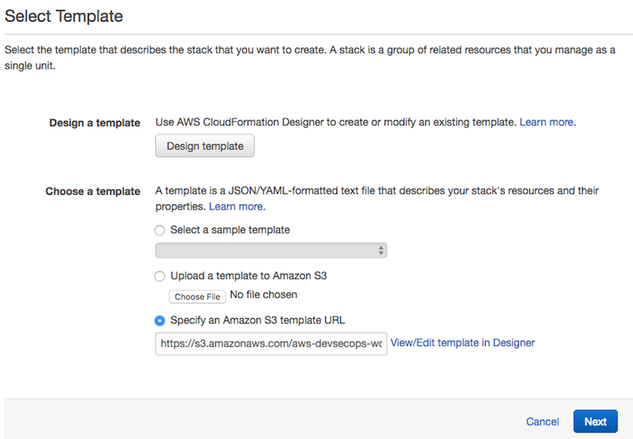  
3. For the purposes of this exercise, you may leave the details unchanged. Click "Next". 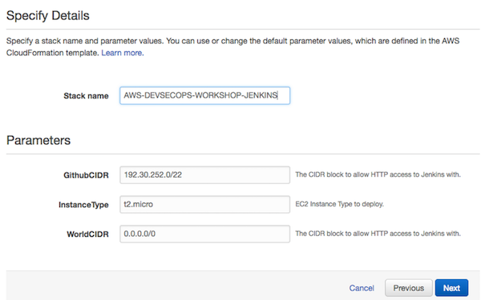  
4. You may (optionally) add tags and an IAM role to your stack. Then click "Next". 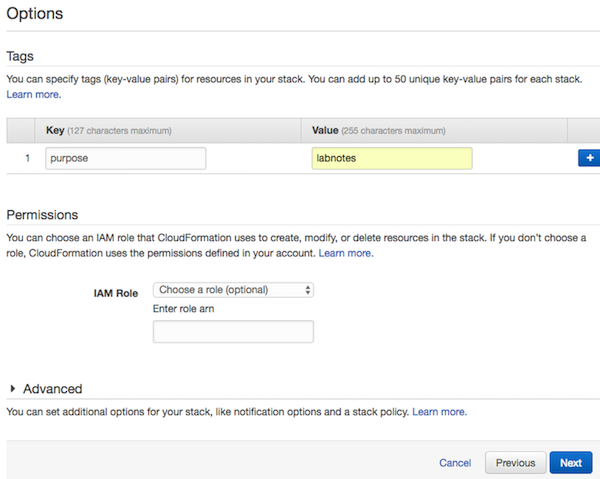  
5. Once you have completed all the configuration steps, take a moment to review the details. 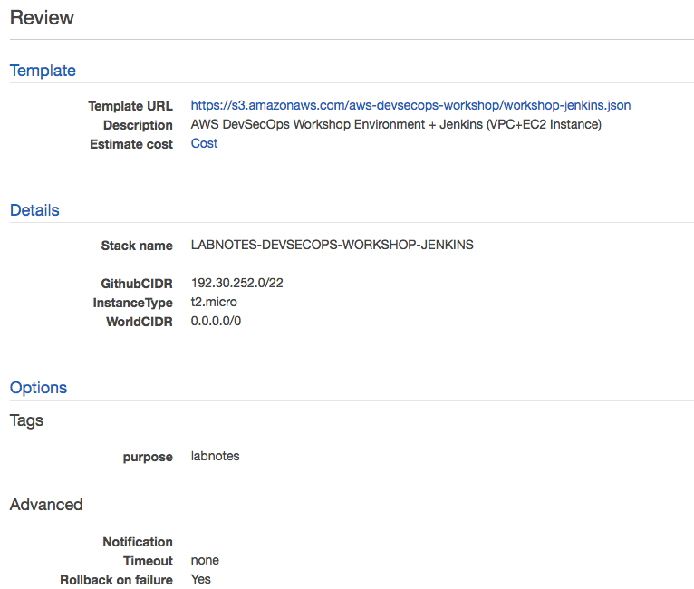  
6. Make sure to acknowledge the "CloudFormation may create IAM resources" checkbox and then click "Create". 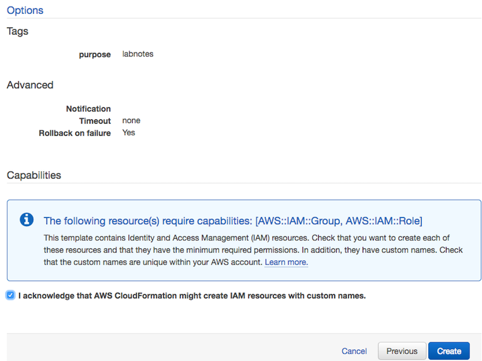  

### Monitor Stack Creation
You can keep tabs on your CloudFormation stack's creation progress via the AWS Console CloudFormation screen

  

### View Stack Results
Once the stack creation is complete, you can take a quick look at the results via the AWS Console.

#### Stack
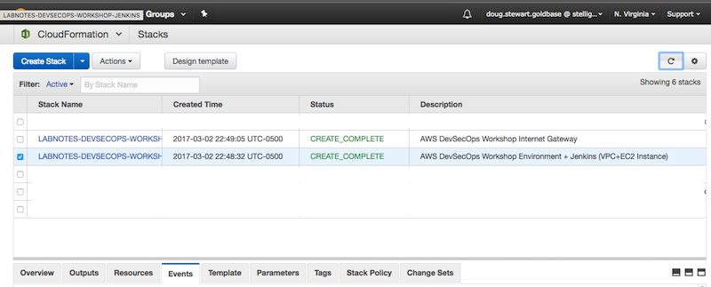  

#### VPC
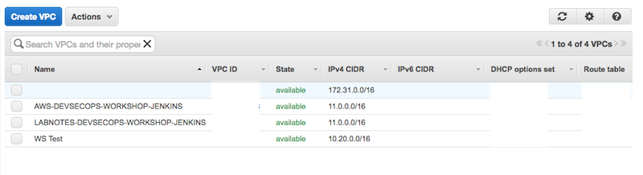  

#### EC2 Instance
Take note of the public IP adress of the Jenkins EC2 instance created during this step, as you will need to have it available to proceed on to section 4.  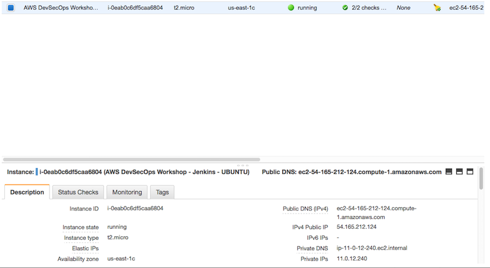  

## Section 4: Running the Jenkins Pipeline (Unchanged)
1. Once the initial stack has been created, you will have access to a single EC2 instance running Jenkins. Using the public IP address listed in Section 3->EC2 Instance, direct your web browser to `http://[EC2 public IP]:8080` in order to load the Jenkins login page.  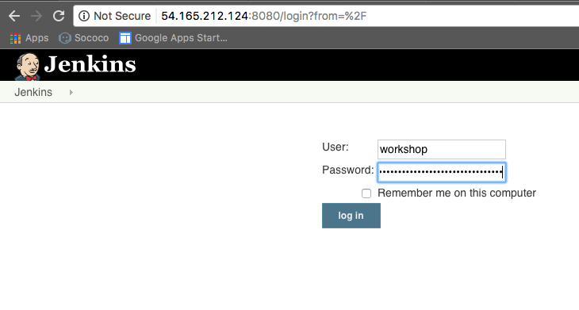  
2. Log in to the Jenkins instance using the default username (`workshop`) and password (`Fancy$Treasury!Effective!Throw^6`). You should see a view similar to this: 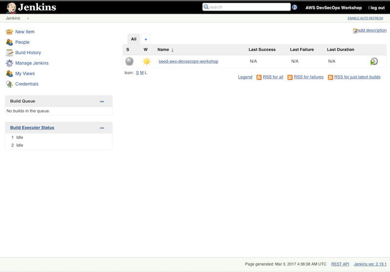  
3. Click the `seed-aws-devops-workshop` link under "Name" in the right-hand table. You should see the following screen. 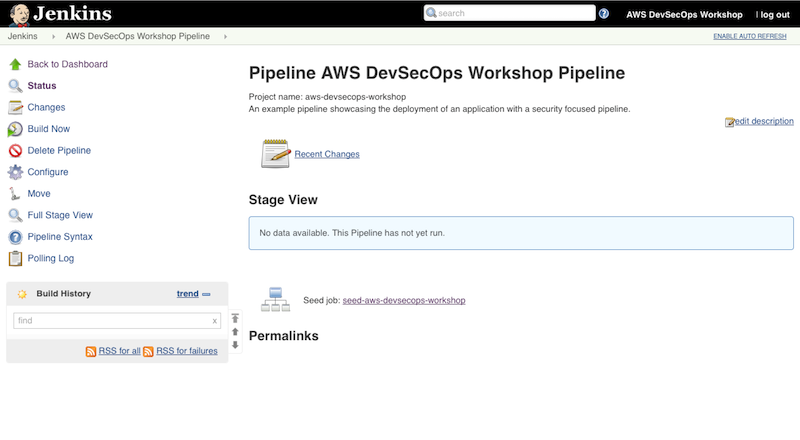  
4. Click "Build Now" in the left-hand menu. 
5. This pipeline job will run fairly quickly and create a new job entry on the dashboard, "AWS DevSecOps Workshop Pipeline". 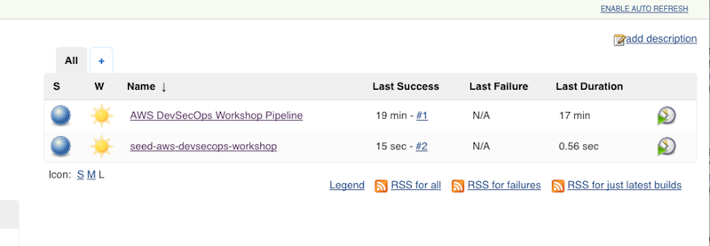  
6. Click on "AWS DevSecOps Workshop Pipeline".
7. Click "Build" in the left-hand menu.
8. You may monitor the progress of the pipeline job as it steps through the various pipeline stages. 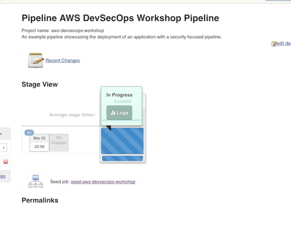  
9. Once all the pipeline steps are complete, you should see a screen similar to this: 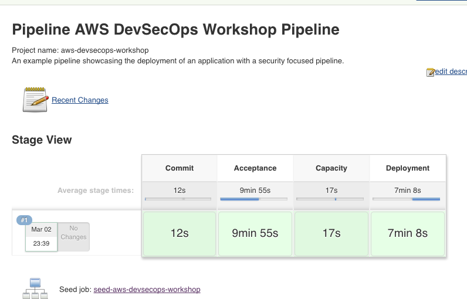  
10. Navigate back to your AWS Console and to the EC2 Instances screen. You should see two newly-created EC2 instances named "AWS DevSecOps Workshop - acceptance" and "AWS DevSecOps Workshop - production". 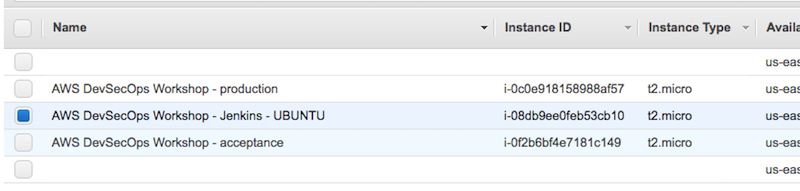  
11. Note the public IP address of the EC2 instances.
12. Direct your browser to either IP address to verify that the extremely simple Nginx installation was configured and started correctly by the build pipeline.  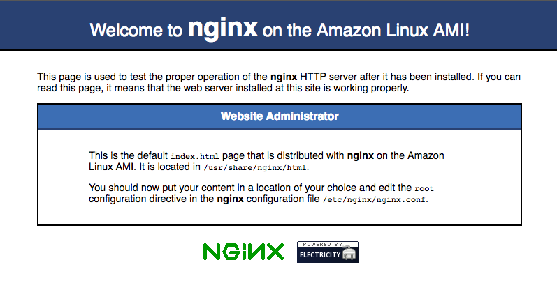  
13. You are now finished with the standard, unaltered portion of the workshop.

## Section 5: Running an Altered Jenkins Pipeline
### Simple Test: Is it up?
For this section, we will simply test whether a given Ec2 instance is responding to HTTP traffic. Since we have not established direct access to the hosts and are thus unable to stop the service directly, simply do the following:

1. Using the EC2 management console, set the Acceptance instance's Instance State to "Stop".
2. Once it has finished powering down, return to the Jenkins console and click "Build Now" again on the "AWS DevSecOps Pipeline" job.
3. Your Jenkins pipeline should fail at the "Acceptance" stage. 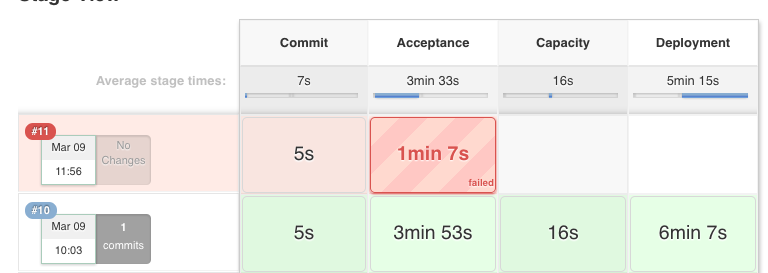  
4. If you wish, you may examine the Jenkins results in more detail. They aren't particularly helpful in diagnosing this particular error. 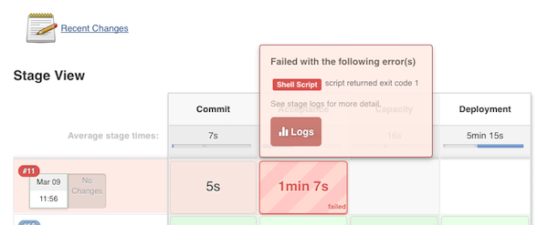  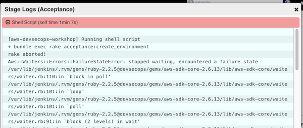  
5. Return to the EC2 management console and set the Acceptance instance's Instance State to "Start".
6. Once the EC2 instance has fully resumed, return to the Jenkins pipeline page and click "Build Now" again.
7. The Jenkins pipeline should now succeed.  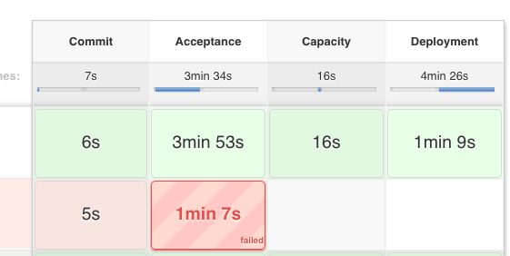  
8. You may, if you wish, repeat the above steps with the "Production" EC2 instance. It should fail at the final stage of the pipeline ("Deployment"). 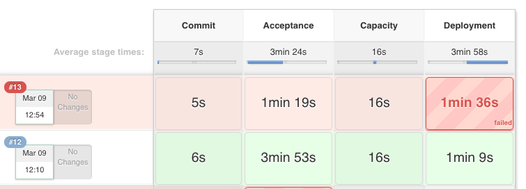  
9. Return the "Production" EC2 instance to "Start". Optionally, you may re-run the pipeline to ensure that the pipeline succeeds once the "Production" instance has fully returned to service.

### Complex Test: Alter the test conditions
For this test, you will need to utilize the fork of the project repository (listed below "Prerequisites" above).

1. Navigate to your fork on Github.
2. Click on the "Clone or Download" button at the top right.
3. Click "Use SSH".
4. Copy the string starting with `git@github.com...`
5. Now navigate to your Jenkins console.
6. Click on the "AWS DevSecOps Workshop Pipeline" job.
7. Click "Configure" in the left-hand navigation.
8. Click the "Pipeline" tab, or scroll down to the bottom of the page.
9. Under "Repository URL", replace the value with the string you just copied from Github. 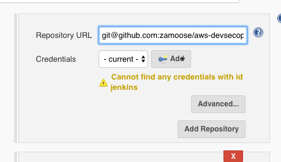  
10. Click "Save".
11. **OPTIONAL:** You may run another pipeline job to ensure that everything is succeeding with the altered Github link (it should be).
12. Return to your Github fork in your web browser.
13. Navigate to `https://github.com/[Github username]/aws-devsecops-workshop/blob/master/features/webserver.feature`. This file describes some of the acceptance tests that are performed on the Acceptance and Production instances' web outputs.
14. Make sure you're logged in.
15. Click on "Edit this file" at the top right.  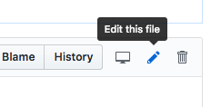  
16. Change "Welcome to <strong>nginx</strong> on the Amazon Linux AMI!" to something else under the `@acceptance` portion of the file. For instance:     
17. Scroll to the bottom and click "Commit changes".
18. Now, return to your Jenkins console.
19. Click "Build Now".
20. The pipeline should fail at the Acceptance phase.  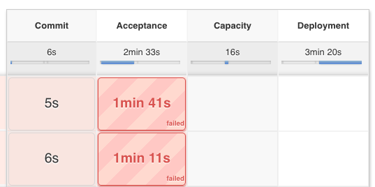  
21. Return to the Github project and edit the file again, this time replacing the string with the correct string (preserved under the `@production` section below the `@acceptance` one).
22. Click "Commit changes".
23. Now return to your Jenkins console.
24. Click "Build Now" again.
25. This time, the pipeline should succeed.  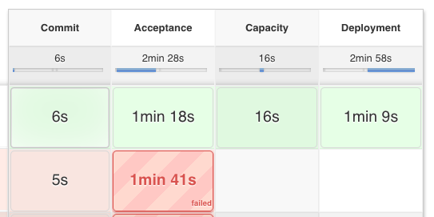  
26. **OPTIONAL:** Repeat the above steps using the `@production` section instead. Your pipeline should fail at the "Deployment" stage instead of the "Acceptance" one.

Congratulations! You have now demonstrated that you can alter the test conditions for the Acceptance and Production using your personal Github fork of the project. 

## Section 6: Testing Arbitrary CloudFormation Templates
In this section, we will demonstrate how to test arbitrary CloudFormation templates as a portion of your pipeline. This can act as a useful step for making sure that infrastructure features under development pass the basic best-practices as encapsulated in this pipeline (particularly [CFN Nag](https://github.com/stelligent/cfn_nag)).

For the purposes of these exercises, the explicit interaction with your forked Github repository is considered out of scope, so we will not go into detail on each of the steps.

### Upload an incorrect template
1. Return to your Github fork of the project.
2. The DevSecOps pipeline will automatically test files contained in `provisioning/cloudformation/templates/` in the repository.
3. Using either the web browser or a locally-cloned version of the repository, copy the contents of `provisioning/cloudformation/templates/deployment.json` and commit to the repository. Name it `deploymenttest.json`.   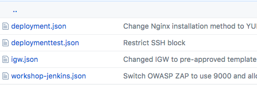  
4. Edit the copy and change it to be invalid JSON. For instance, add a spurious semicolon somewhere in-line.
5. Return to your Jenkins console.
6. If a pipeline job has not automatically been triggered by the commit to the Github repository, click "Build Now" to attempt a build.
7. The "Commit" stage of the pipeline should fail with a message about legitimate JSON. This demonstrates that a basic level of JSON parsing is occurring.
8. Return to the Github repository and remove the extra incorrect character[s] you added above. 
9. Save the JSON file.
10. Return to Jenkins and trigger another pipeline job. It should succeed.

### Test for security best-practices
1. Return to the Github clone. We will be altering our copied CloudFormation template to introduce a security warning.
	* (For reference's sake, the security tests for CFN Nag are in [stelligent/cfn_nag/blob/master/features/cidr_rules.feature](https://github.com/stelligent/cfn_nag/blob/master/features/cidr_rules.feature))
2. Under the `Resources` section of the JSON template, introduce a new rule to the `ApplicationSecurityGroup` for inbound SSH. For instance:   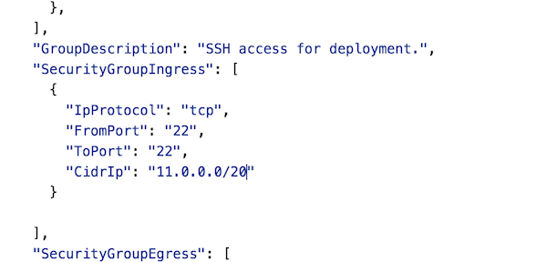  
3. Commit the change. Note that the `CidrIp` property is set to match the IP range of the VPC and subnet we created earlier.
4. Return to the Jenkins console and trigger a pipeline job if one has not already automatically been started. It should succeed as per usual.
5. If you examine the logs for the "Commit" stage of the pipeline, you should see normal output similar to this:  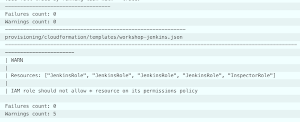  
6. Return to Github.
7. Edit the template's CIDR range to be open to the world.  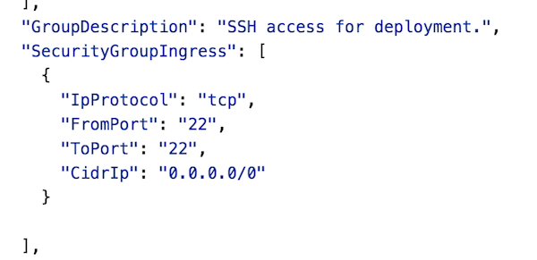  
8. Return to Jenkins and trigger a pipeline job.
9. The pipeline should complete successfully. ***However***, *a warning should be triggered in the Commit stage and logged there*.
	* It may seem confusing, but a pipeline job will not fail on a "WARN" message -- it will only fail if a "FAIL" stage is triggered.
10. Click on the logs for the Commit stage. Note the warning logged (it should look similar to this):   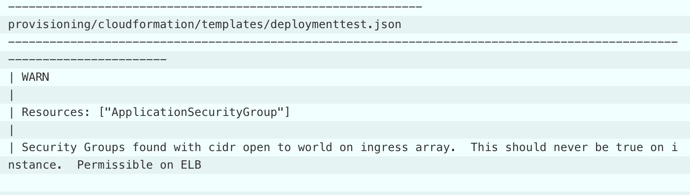  
11. Congratulations! You've now worked through how to add an arbitrary CloudFormation template to the pipeline and have it scanned for security best-practices.